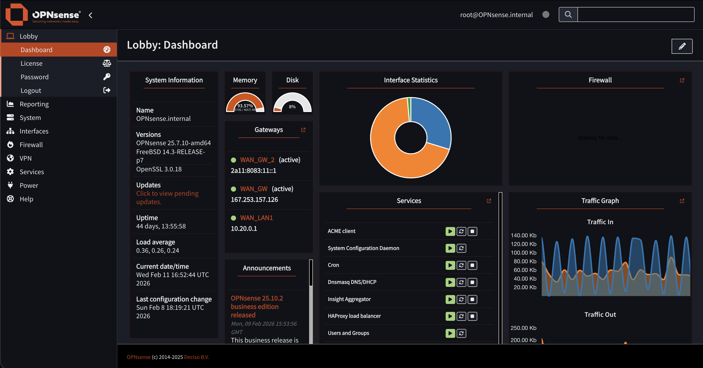
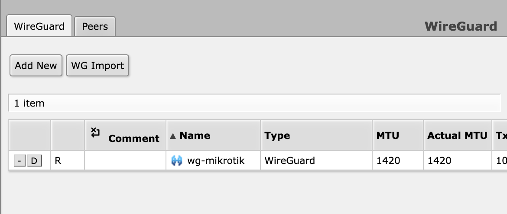
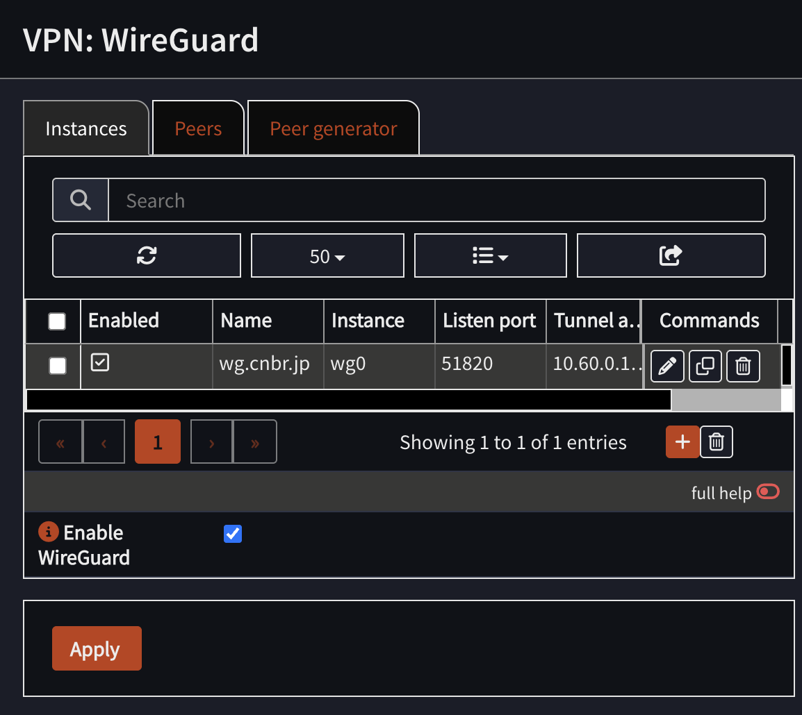
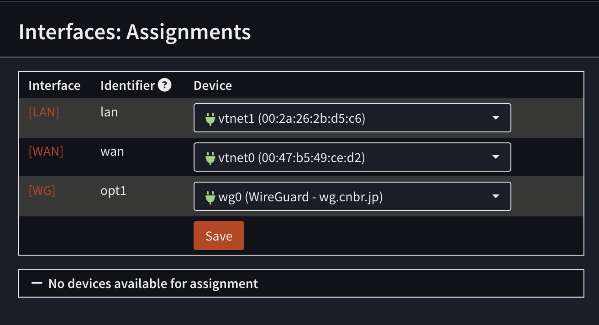
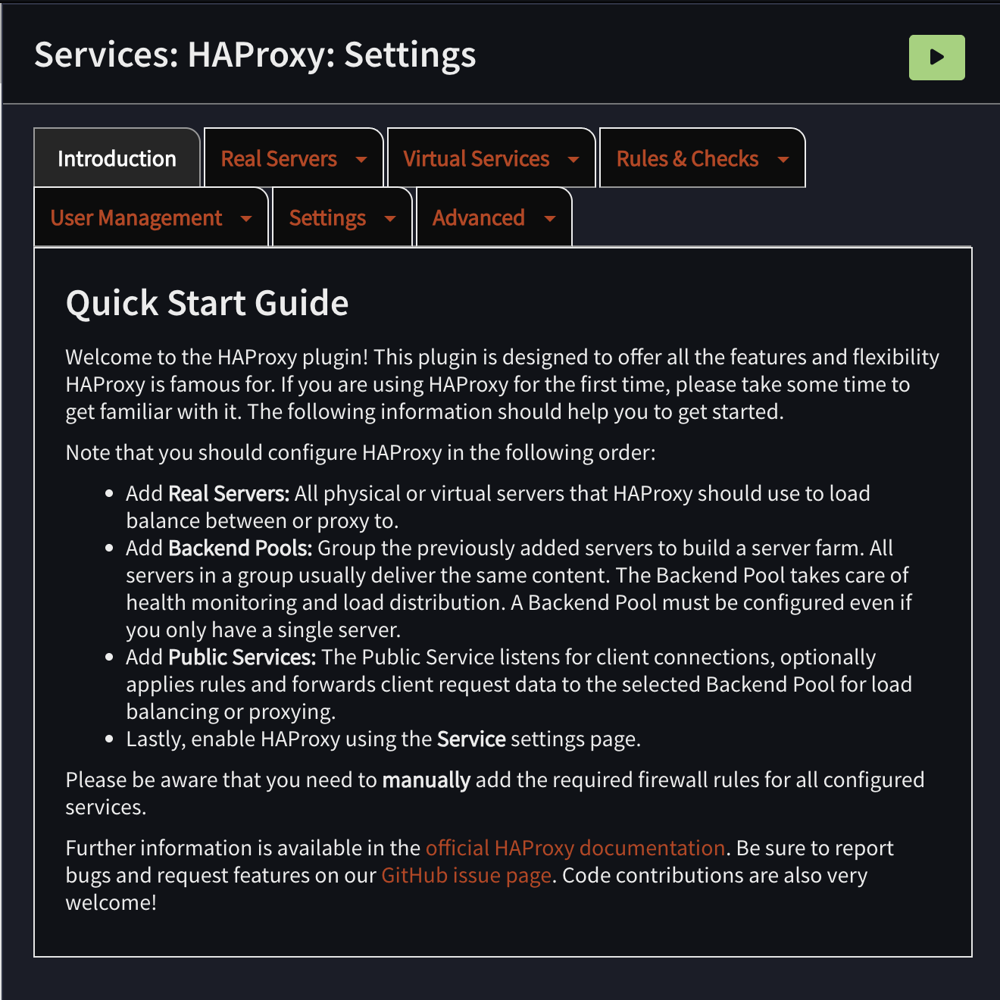

> [!NOTE]
> This post is about how I built a gateway VPS using `OPNSense`. This article does not cover technical details step-by-step but more about my experience and lessons learned. I hope you find it interesting.

I’ve always had a **weird bias** about `FreeBSD` vs `Linux` for server use.

> FreeBSD just *feels* better, especially the TCP/IP stack.

> Linux is great, but FreeBSD networking feels… like Ferrari

Anyway, I have **three VPS** on the same provider. Two of them are **high spec (for me)** and already running Linux doing real work. The third one is low spec and basically doing nothing. My provider also supports **private virtual IP** between VPS instances, so I had a cursed idea:

> What if the idle VPS becomes the `gate` of everything?

Like a small **edge router** VPS that handles routing/firewall/VPN/reverse proxy, while the bigger Linux boxes just focus on workloads.

So I went down the FreeBSD firewall rabbit hole.

## OPNSense vs pfSense: I picked OPNSense for a lazy reason

I knew about [pfSense](https://www.pfsense.org/)/[OPNSense](https://opnsense.org/) since my undergrad era, my friend (Ahmad) was comparing router OS performance (`pfSense`, `OpenWrt`, etc.) for his thesis while I was benchmarking an Ethereum private network. We published our papers, 
- [Ahmad's Paper (ANALYSIS OF WIRELESS NETWORK SIMULATION BASED ON OPENWRT AND PFSENSE WITH QUALITY OF SERVICE INDICATORS ON LOW-COST NETWORK INFRASTRUCTURE
)](https://jutif.if.unsoed.ac.id/index.php/jurnal/article/view/4047)
- [my Paper (Comparative analysis of PoS and PoA consensus in Ethereum environment for blockchain based academic transcript systems
)](https://beei.org/index.php/EEI/article/view/9219).

Now the funniest part is that I actually needed one of them.

When choosing `OPNSense vs pfSense`, I went with `OPNSense` (sorry Ahmad). Either because I did a deep philosophical comparison nor because I’m a firewall guru.

My brain literally went:

> OPNSense is a pfSense fork → `okay I’ll use OPNSense`.

That’s it. **Zero drama**.




## Easy Installation but Harder Access for First Time

OPNSense installation is chill, feels like installing FreeBSD. Then you reboot, you configure interfaces, you feel smart for 3 minutes and then the web UI is **not accessible**.

I had two NICs. I assigned WAN/LAN. Done. Then I tried to open the Web UI and… nope. I repeating the process a few times, checking IPs, interfaces, everything. Still no access. 

At that moment I learned the classic lesson:

> OPNSense Web UI is basically `LAN-only` by default and the firewall is *not here to be your friend*.

As a newbie, this combo is deadly. Because you can easily lock yourself out and then you start questioning life. Also I tried to **just edit the config file like in Linux.**

> Spoiler: I didn’t even know where the web UI config file was. And even if I found it, I wasn’t confident editing it manually because it’s not that kind of system.

So yeah. First time OPNSense experience: **I blocked myself**.

My solution was very professional:

```sh
pfctl -d 
```

then 

```sh
pfctl -e
```


> `disable pf` → finish setup in Web UI → `enable pf` again

Yes, I temporarily **turned off the firewall on a firewall OS, so I could configure the firewall**. A peak engineering, but it worked, and after that I could proceed normally and tighten rules properly.


## WireGuard: I suffered on FreeBSD… until OPNSense fixed my misunderstanding

Now the fun part: VPN.

I have a `MikroTik router` in my homelab managing all my internal VMs. Since MikroTik supports `WireGuard` now, I *knew* I could tunnel my homelab to the internet somehow.

But here’s the thing: for a long time I had a **wrong mental model**.

I thought WireGuard “server” means you need **an extra dedicated server** just for tunneling. Like a separate box that only exists to accept connections and forward traffic. That idea alone already felt like *more infra, more pain, more Docker*.

So I kept avoiding the **proper** setup and relied on [wg-easy](https://github.com/wg-easy/wg-easy) because it was simple until I remembered: `wg-easy` = Docker again. **Oh no.. Docker again.**

Then I tried WireGuard inside OPNSense and suddenly it clicked:

> I don’t need an additional tunneling server. **OPNSense *is* the gateway, so it can be the WireGuard server too.**




Once I understood the **peer** concept, everything made way more sense. WireGuard isn’t really “server vs client” the way I used to imagine it, it's basically **peers exchanging keys**, and one of them just happens to be the “hub” in my topology. After that, the setup felt weirdly smooth:

* generate keys
* define peers
* set allowed IPs properly

The setup is smooth, but another challenge appeared: **peers cannot ping**. 


As a noob, I thought that `WireGuard (Group)` is a rule for the WireGuard interface. But, I was wrong. First you should create interface first, so WireGuard real rules will appear under the correct interface (in my case, `WG`).




That part confused me for a while, but after I understood it, everything worked fine.

Now my setup looks like this:

```
                           (Provider Private Network: 10.20.0.0/16)
        ┌───────────────────────────────────────────────────────────────────┐
        │                                                                   │
        │   [OPNSense VPS] 10.20.0.1                                        │
        │       |                                                           │
        │       |---> [Linux Server 1] 10.20.0.11  ---> (Services)          │
        │       |                                                           │
        │       |---> [Linux Server 2] 10.20.0.12  ---> (Services)          │
        │       |                                                           │
        │       |                                                           │
        │       └── WireGuard: wg0 10.60.0.1/24                             │
        │                    (Tunnel Network: 10.60.0.0/24)                 │
        └───────────────────────────────┬───────────────────────────────────┘
                                        │
                                        │  WireGuard tunnel (10.60.0.0/24)
                                        │
                                wg peer │ 10.60.0.2/24
                              ┌─────────▼─────────┐
                              │   [MikroTik]      │
                              │   LAN GW:         │
                              │   192.168.60.1/24 │
                              └─────────┬─────────┘
                                        │
                                        │ (Homelab LAN: 192.168.60.0/24)
                         ┌──────────────┴────────────────┐
                         │                               │
                 [Proxmox Host]                   [VMs on Proxmox]
               192.168.60.10                      192.168.60.101
                                                  192.168.60.102
                                                  ...

```


## HAProxy: friendship ended with Nginx Proxy Manager

Next, reverse proxy.

Before this, I used [Nginx Proxy Manager](https://nginxproxymanager.com/) a lot because it’s easy: click-click-done, certificates, hosts, whatever. But it’s Docker-based and my gateway VPS was supposed to be `clean` and `network-focused`.

Then I noticed OPNSense can use [HAProxy](https://www.haproxy.org/) (and some people also use `NGINX`). I read a bit and my brain liked HAProxy because:

* It’s very strong for TCP (Layer 4)
* Load balancing feels **native** to it
* It matches the **gateway** role better (for me)




`NGINX` is amazing, but `HAProxy` felt like:

> “I exist to move traffic efficiently.”

So yeah:

> Friendship ended with NPM. HAProxy is my best friend now.

…**but also the friend that keeps giving you migraines.**

Because unlike NPM where you **just map domain → IP:port**, HAProxy wants you to understand **its whole worldview**:

* `Frontends` (where traffic enters)
* `Backends` (where traffic exits)
* `Backend pools` (multiple servers behind a backend)
* `Health checks` (because HAProxy refuses to send traffic to something it thinks is dead)


Below here is comparison diagrams of both setups for two services: `memo.cnbr.jp` (hosted on Linux Server 1) and `jellyfin.cnbr.jp` (hosted on a VM in my homelab via WireGuard) if I used Nginx Proxy Manager vs HAProxy.

```
Nginx Proxy Manager

                        ┌─────────────────────────────┐
Internet / Clients ---> │ NPM (Docker) :443 / :80     │
 HTTPS SNI/Host         └──────────────┬──────────────┘
                                       |
                          Proxy Hosts (hostname routing)
                                       |
          +----------------------------+--------------------------------+
          |                                                             |
          v                                                             v
┌───────────────────────┐                                      ┌───────────────────────┐
│ memo.cnbr.jp          │                                      │ jellyfin.cnbr.jp      │
│ Forward to:           │                                      │ Forward to:           │
│ 10.20.0.11:3000       │                                      │ 192.168.60.101:8096   │
│ SSL: ON (Let's Encrypt│                                      │ SSL: ON (Let's Encrypt│
│ Health check: (lol)   │                                      │ Health check: (lol)   │
└───────────────────────┘                                      └───────────────────────┘


========================================================================================

HAProxy

                           ┌──────────────────────────────────┐
Internet / Clients  HTTPS  │ OPNSense HAProxy Frontend :443   │
 SNI/Host routing -------->│ Public Service "https-443"       │
                           └───────────────┬──────────────────┘
                                           |
                                   Rules (ordered)
                                           |
                 +-------------------------+--------------------------+
                 |                                                    |
                 v                                                    v
       Condition: hdr(host)=memo.cnbr.jp                    Condition: hdr(host)=jellyfin.cnbr.jp
                 |                                                    |
                 v                                                    v
        Action: use backend pool "bk_memo"                 Action: use backend pool "bk_jellyfin"
                 |                                                    |
                 v                                                    v
     Backend Pool "bk_memo" (10.20.0.0/16)              Backend Pool "bk_jellyfin" (via WG)
     server: 10.20.0.11:3000  (check?)                  server: 192.168.60.101:8096 (check?)
                 |                                                    |
                 v                                                    v
            (Services)                                           (Jellyfin VM)

```

And that last part… the `health checks`… is where my sanity started leaking.

The most evil moment is when everything looks fine, DNS is correct, certificates are okay, your service is running, but your browser says:


At one point, my `Jellyfin` suddenly wasn’t reachable. And because my setup involves `OPNSense` + `HAProxy` + `WireGuard` + `MikroTik` + `firewall rules`, my brain immediately went full paranoia mode:

* “Did I break the WireGuard tunnel?”
* “Is MikroTik routing wrong?”
* “Is OPNSense blocking traffic?”
* “Did I mess up NAT or firewall rules?”
* “Is the private IP path dead?”
* “Is my VPS provider doing something weird?”

So I started checking everything layer by layer like a confused network detective. Then… after way too long… I found the real reason:

> HAProxy marked the Jellyfin backend as **DOWN** not because Jellyfin was dead but because the `health check` failed.

So HAProxy just refused to forward traffic and gave me `503`, even though Jellyfin itself was actually fine. That moment was hilarious because I was debugging `WireGuard + MikroTik + firewall` like it was a deep network failure and the problem was literally:

> “Health check says no.”

Since then I adopted my professional HAProxy workflow

> Make the HAProxy route work first, **skip health checks at the beginning**, then enable health checks later 


## Conclusion

So yeah, that’s my experience building a gateway VPS with OPNSense.
I’m still learning a lot, but so far it’s been fun.


`// END`